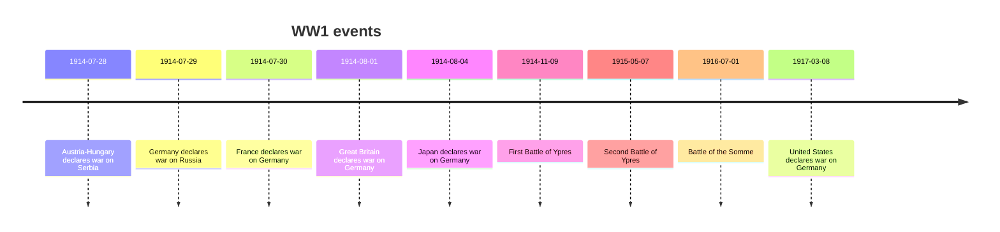

# Text::SubParsers

Raku package for extracting and processing of interpret-able sub-strings in texts.

## Installation

From Zef ecosystem:

```
zef install Text::SubParsers
```

From GitHub:

```
zef install https://github.com/antononcube/Raku-Text-SubParsers.git
```

------

## Usage examples

### Date extractions

Here we extract dates from a text:

```perl6
use Text::SubParsers;
my $res = "Openheimer's birthday is April 22, 1905 or April 2, 1905, as far as I know.";

Text::SubParsers::Core.new('DateTime').subparse($res).raku;
```
```
# $["Openheimer's birthday is ", DateTime.new(1905,4,22,0,0,0), " or ", DateTime.new(1905,4,2,0,0,0), ", as far as I know."]
```

Compare with the result of the `parse` method over the same text:

```perl6
Text::SubParsers::Core.new('DateTime').parse($res);
```
```
#ERROR: Cannot interpret the given input with the given spec 'DateTime'.
# (Any)
```

Here are the results of both `subparse` and `parse` on string that is a valid date specification:

```perl6
Text::SubParsers::Core.new('DateTime').subparse('April 22, 1905');
```
```
# 1905-04-22T00:00:00Z
```

```perl6
Text::SubParsers::Core.new('DateTime').parse('April 22, 1905');
```
```
# 1905-04-22T00:00:00Z
```

### Sub-parsing with user supplied subs

Instead of using `Text::SubParsers::Core.new` the functions `get-sub-parser` and `get-parser`
can be used.

Here is an example of using:
- Invocation of `get-sub-parser`
- (Sub-)parsing with a user supplied function (sub)

```perl6
sub known-cities(Str $x) { 
    $x ∈ ['Seattle', 'Chicago', 'New York', 'Sao Paulo', 'Miami', 'Los Angeles'] ?? $x.uc !! Nil 
}

get-sub-parser(&known-cities).subparse("
1. New York City, NY - 8,804,190
2. Los Angeles, CA - 3,976,322
3. Chicago, IL - 2,746,388
4. Houston, TX - 2,304,580
5. Philadelphia, PA - 1,608,162
6. San Antonio, TX - 1,5
")
```
```
# [
# 1.  NEW YORK  City, NY - 8,804,190
# 2.  LOS ANGELES , CA - 3,976,322
# 3.  CHICAGO , IL - 2,746,388
# 4. Houston, TX - 2,304,580
# 5. Philadelphia, PA - 1,608,162
# 6. San Antonio, TX - 1,5
# ]
```

Here is the "full form" of the last result

```perl6
_.raku
```
```
# $["\n1. ", "NEW YORK", " City, NY - 8,804,190\n2. ", "LOS ANGELES", ", CA - 3,976,322\n3. ", "CHICAGO", ", IL - 2,746,388\n4. Houston, TX - 2,304,580\n5. Philadelphia, PA - 1,608,162\n6. San Antonio, TX - 1,5\n"]
```

### Sub-parsing with `WhateverCode`

With the parser spec `WhateverCode` an attempt is made to extract dates, JSON expressions, numbers, and Booleans (in that order).
Here is an example:

```perl6
get-sub-parser(WhateverCode).subparse('
Is it true that the JSON expression {"date": "2023-03-08", "rationalNumber": "11/3"} contains the date 2023-03-08 and the rational number 11/3?
').raku
```
```
# $["\nIs it", Bool::True, "that the JSON expression", {:date("2023-03-08"), :rationalNumber("11/3")}, "contains the date", DateTime.new(2023,3,8,0,0,0), "and the rational number", <11/3>, "?\n"]
```

------

## Processing LLM outputs

A primary motivation for creating this package is the post-processing the outputs of
Large Language Models (LLMs), [AA1, AAp1, AAp2, AAp3].

Here is an example of creating a LLM-function and its invocation over a string:

```perl6
use LLM::Functions;

my &fs = llm-function(
        {"What is the average speed of $_ ?"},
        llm-evaluator => llm-configuration(
                'PaLM',
                prompts => 'You are knowledgeable engineer and you give concise, numeric answers.'));

say &fs('car in USA highway');
```
```
# 79.5 mph
```

Here is the corresponding interpretation using sub-parsers:

```perl6
get-sub-parser('Numeric').subparse(_.trim).raku;
```
```
# $[79.5, "mph"]
```

Here is a more involved example in which:

1. An LLM is asked to produce a certain set of events in JSON format
2. The JSON fragment of the result is parsed 
3. The obtained list of hashes is transformed into [Mermaid-JS timeline diagram](https://mermaid.js.org/syntax/timeline.html)


```perl6
my &ft = llm-function(
        {"What are the $^a most significant events of $^b? Give the answer with date-event pairs in JSON format."},
        form => get-sub-parser('JSON'),
        llm-evaluator => llm-configuration('PaLM', max-tokens => 500));

my @ftRes = |&ft(9, 'WWI');
@ftRes = @ftRes.grep({ $_ !~~ Str });
```
```
# [{date => 1914-07-28, event => Austria-Hungary declares war on Serbia} {date => 1914-07-29, event => Germany declares war on Russia} {date => 1914-07-30, event => France declares war on Germany} {date => 1914-08-01, event => Great Britain declares war on Germany} {date => 1914-08-04, event => Japan declares war on Germany} {date => 1914-11-09, event => First Battle of Ypres} {date => 1915-05-07, event => Second Battle of Ypres} {date => 1916-07-01, event => Battle of the Somme} {date => 1917-03-08, event => United States declares war on Germany}]
```

```perl6, output.lang=mermaid, output.prompt=NONE
my @timeline = ['timeline', 'title WW1 events'];
for @ftRes -> $record {
    @timeline.append( "{$record<date>} : {$record<event>}");
}
@timeline.join("\n\t")
```


------

## References

### Articles

[AA1] Anton Antonov,
["LLM::Functions"](https://rakuforprediction.wordpress.com/2023/07/21/llmfunctions/),
(2023),
[RakuForPrediction at WordPress](https://rakuforprediction.wordpress.com).

### Packages

[AAp1] Anton Antonov,
[LLM::Functions Raku package](https://github.com/antononcube/Raku-LLM-Functions),
(2023),
[GitHub/antononcube](https://github.com/antononcube).

[AAp2] Anton Antonov,
[WWW::OpenAI Raku package](https://github.com/antononcube/Raku-WWW-OpenAI),
(2023),
[GitHub/antononcube](https://github.com/antononcube).

[AAp3] Anton Antonov,
[WWW::PaLM Raku package](https://github.com/antononcube/Raku-WWW-PaLM),
(2023),
[GitHub/antononcube](https://github.com/antononcube).

